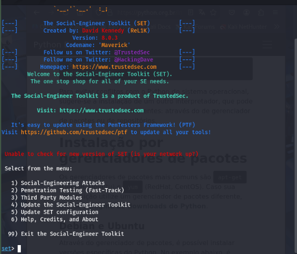
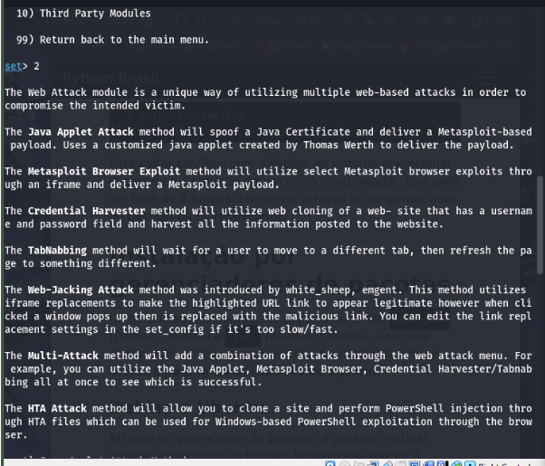
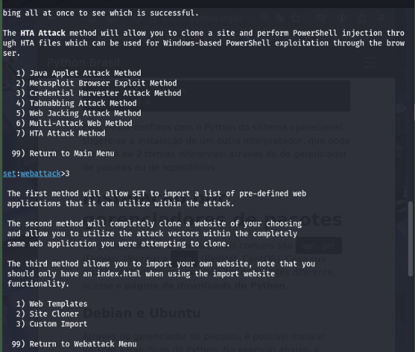
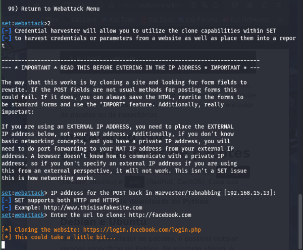
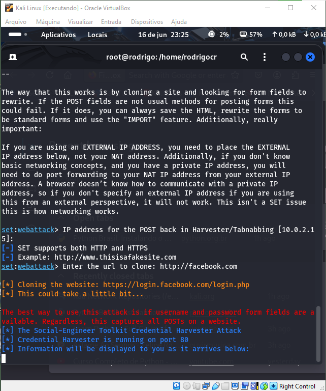

# cybersec-ex 
Exercicios do curso Cybersecurity Specialist - DIO

Projeto Criando um phishing no kali linux

Descrição do Desafio

Este projeto tem como objetivo utilizar a ferramenta setoolkit para criar uma página falsa do Facebook para captura de senhas.

Ferramenta usadas:

- setoolkit, 
- oracle virtual box e 
- iso do kali linux

Prints do setoolkit e etapas:

1. Tipo de ataque: Social Engineering Attacks

2. Vetor de ataque: Web Site Attack Vectors

3. Método de ataque: Site Cloner

Print-1

- Escolha do menu a opção 1) Social Engineering Attacks

Print-2

Print-3

- Escolha a opção 3) Credential Harvester Attack Method

Print-4

Print-5

-------------------------------------------------------